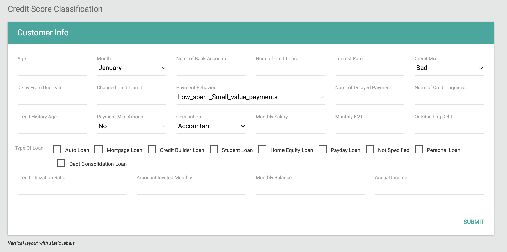
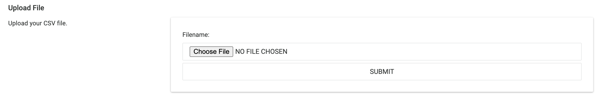
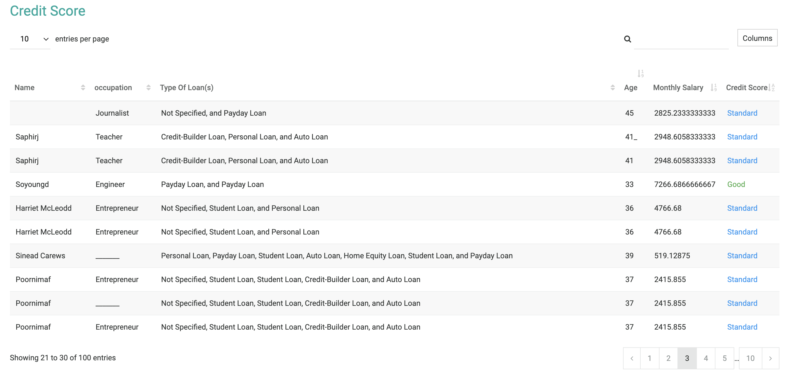

# Iris Prediction API

A simple Web-based application to predict the credit score classification that trained using Random Forest model. The web application is connected to the model via fastapi python library.

## Features
- Predict customer credit score (0 = `Poor`, 1 = `Standard`, 2 = `Good`).
- FastAPI framework for API endpoints.
- Simple Python, PHP, HTML, CSS, JQuery web-app.

---

## File Structure
- `app/main.py`: FastAPI application with endpoints.
- `app/credit_score_model.pkl.zip`: Pre-trained Customer Credit Score model (Random Forest).
- `notebook/Credit Score Classification - 3 Class.ipynb`: Jupyter Notebook for training the model.
- `web/index.php` Index web page.
- `web/config.php` Config file for web app.
- `web/functions.php` php file that contains functions.
- `web/form.php` The page that contain a form to input data.
- `web/upload.php` The page that contain a simple form to upload .csv file.
- `requirements.txt`: Python dependencies.

---

## Installation and Usage

### Prerequisites
- Python 3.10+
- pip
- Apache 2.4
- PHP 7.4

### Steps
1. Clone the repository:
   ```bash
   git clone https://github.com/yokilabs/credit-score-classification.git
   cp -rv credit-score-classification /var/www/
   cd /var/www/credit-score
   ```

2. Install dependencies:
    ```bash
    pip install -r app/requirements.txt
    ```

3. Run the FastAPI application:
    ```bash
    uvicorn app.main:app --reload
    ```

4. Run the FastAPI application:
- Open http://127.0.0.1:8000/docs

5. Run the web application:
- Open http://localhost/credit-score-classification/web/

## Endpoints
- `GET /cresco/`
    - Health check for the API
- `POST /cresco/predict/`
    - Input: JSON object with all features.
    - Output: Predicted credit score (Poor, Standard, Good).
- `POST /cresco/upload_csv/`
    - Input: .csv file `datas/test 0-100.csv`
    - Output: filename, predicted (.csv) file directory, converted dataframe to JSON.

### Example input form:



### Example upload form:



### Example result:



## License

MIT License

## Contact

For questions, contact yoki.wahyu@gmail.com.
